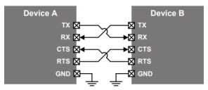
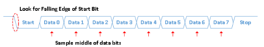
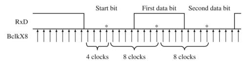

# ProgettoFinaleRetiLogiche

## Traccia
Progettazione di un trasmettitore e di un ricevitore UART dotati di segnalazione hardware del controllo del flusso.
La trasmissione UART si basa su 4 linee digitali: TX (Trasmissione), RX (Ricezione), RTS (Request to send) e CTS(Clear to send). Queste linee sono connesse secondo lo schema mostrato di seguito.

La linea di trasmissione assume normalmente valore 1. Quando il trasmettitore intende iniziare un trasferimento dati abbassa la linea a 0 (start bit) quindi trasmette 8 bit, seguiti da un ulteriore 1 (stop bit). La trasmissione avviene sempre e solo in blocchi di 8 bit che, a seconda delle impostazioni possono essere 7 bit di dati più un bit di parità oppure 8 bit di dati, senza parità. La figura seguente mostra la trasmissione di un byte.

Trattandosi di una trasmissione asincrona, i fronti di transizione dei bit non sono allineati ad un clock condiviso fra trasmettitore e ricevitore ma avvengono ad una frequenza fissata, seppur spesso non precisa. Le frequenze tipiche di funzionamento (normalmente indicate come baudrate) sono 9600, 19200, 38400, 57600, 115200, 230400, 460800 e 921600. Dato che la frequenza di trasmissione/ricezione è spesso affetta da errori e disturbi, il segnale sulla linea viene sovracampionato con un clock 8 o 16 volte più veloce della
frequenza effettiva di funzionamento. La figura seguente mostra tale situazione nel caso di sovracampionamento di un fattore 8.

I segnali RTS e CTS implementano il controllo di flusso a livello hardware. Quando un dispositivo (ricevente) è disponibile ed è in grado di accettare dati, mantiene il segnale RTS asserito: data la connessione tra RTS e CTS l’altro dispositivo (trasmittente) vede il segnale CTS asserito e trasmette. Poco prima che il ricevente diventi indisponibile (per esempio quando il suo buffer di ricezione è quasi pieno), questo deasserisce il segnale RTS, che viene rilevato sul CTS del trasmittente, il quale interrompe immediatamente la trasmissione. Una volta realizzato il componente, è richiesto di realizzare un test-bench per la simulazione e la verifica del corretto funzionamento nei diversi casi.